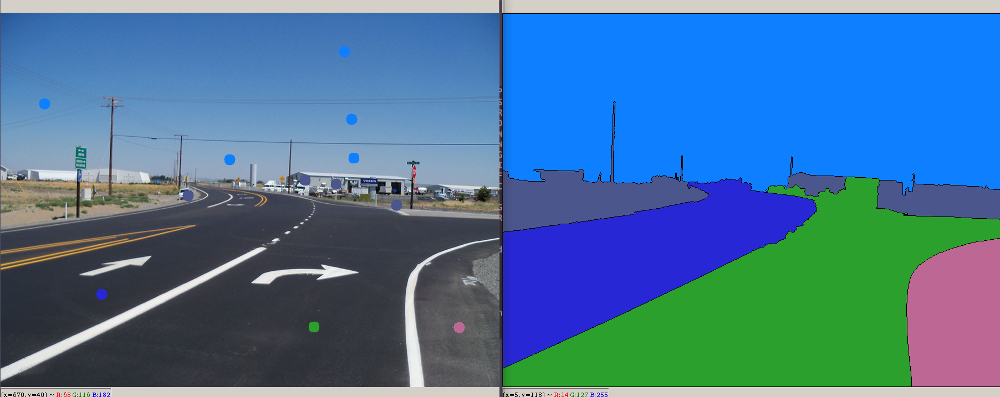

# Watershed Segmentation
Image segmentation with the Watershed algorithm. Starting from user-defined markers, the Watershed algorithm treats pixels values as a local topography (elevation). The algorithm floods basins from the markers until basins attributed to different markers meet on watershed lines. In many cases, markers are chosen as local minima of the image, from which basins are flooded.

* [The Algorithm - Wikipedia](https://en.wikipedia.org/wiki/Watershed_(image_processing))
* [Watershed in OpenCV](https://docs.opencv.org/master/d3/db4/tutorial_py_watershed.html)



## Requirements:

* OpenCV (Python)
* NumPy
* Matplotlib

```bash
pip2 install -r requirements.txt
pip3 install -r requirements.txt
```

## Usage:

-Place your images in the 'img' folder, or use the provided test images

-Enter the image filename when asked (such as '2.png')

-Assign color with numeric keys (1-9), click on the input image to segment

-Save segments with S, clear colors with C

-Press Escape to quit

Run with:

```bash
python watershed-test.py
````
